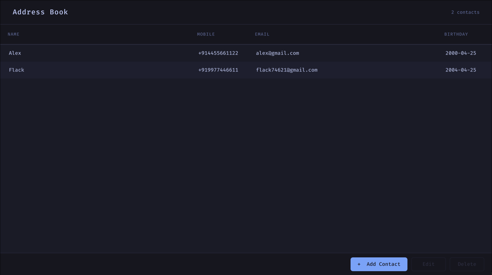
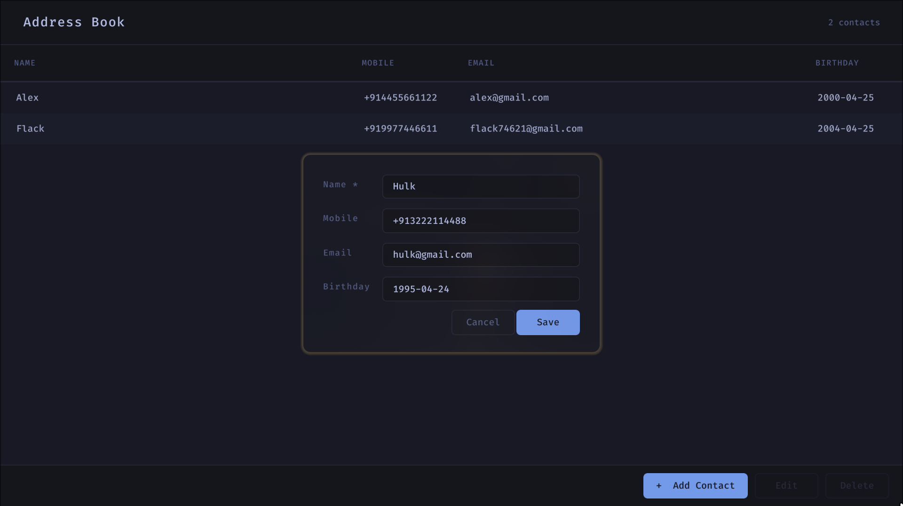
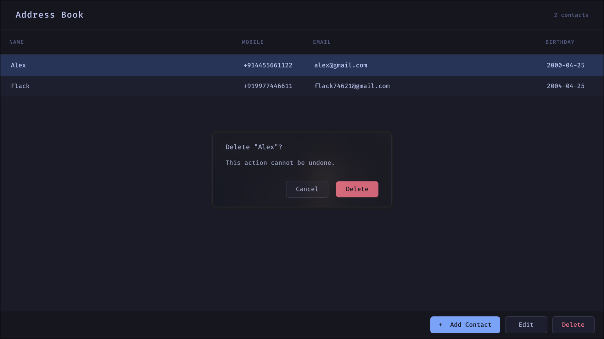

# AddressBook

A simple contact management application built with Qt5 and C++.

## Features

- View all contacts in a sortable table
- Add new contacts via a clean dialog
- Edit existing contacts in-place
- Delete contacts with a confirmation prompt
- SQLite storage — contacts persist between sessions
- Input validation for email addresses, phone numbers, and birthdays
- Keyboard-friendly: Tab through fields, Enter to confirm

## Screenshots

**Contact list**


**Add contact**


**Delete confirmation**


## Requirements

- Debian GNU/Linux (tested on Debian 12 / Ubuntu 22.04+)
- Qt5 development libraries
- g++ with C++17 support
- make

Install dependencies:
```bash
sudo apt-get install qtbase5-dev qtbase5-dev-tools libqt5sql5-sqlite
```

## Build
```bash
qmake addressbook.pro
make
```

This produces an `addressbook` binary in the project root.

## Run
```bash
./addressbook
```

The application creates `contacts.db` in the current working directory on first launch.

## Run Tests
```bash
cd tests
qmake tests.pro
make
./addressbook_tests
```

## Project Structure
```
addressbook/
│
├── .github/
│   └── workflows/
│       └── build.yml
│
├── src/
│   ├── main.cpp
│   ├── contact.h
│   ├── contact.cpp
│   ├── database.h
│   ├── database.cpp
│   ├── mainwindow.h
│   ├── mainwindow.cpp
│   ├── contactdialog.h
│   ├── contactdialog.cpp
│   ├── validator.h
│   └── validator.cpp
│
├── ui/
│   ├── mainwindow.ui
│   └── contactdialog.ui
│
├── tests/
│   ├── tests.pro
│   ├── main_test.cpp       ← single entry point, runs both suites
│   ├── test_validator.h    ← validator test class (no main)
│   └── test_database.h     ← database test class (no main)
│
├── addressbook.pro
├── .gitignore
└── README.md
```

## Contact Fields


| Field    | Required | Validation                 |
|----------|----------|----------------------------|
| Name     | Yes      | Cannot be empty            |
| Mobile   | No       | +CountryCode + 7–15 digits |
| Email    | No       | Standard email format      |
| Birthday | No       | YYYY-MM-DD format          |

## Notes

- SQLAlchemy/Alembic are Python tools and don't apply to a Qt/C++ project. SQLite schema is managed directly via `CREATE TABLE IF NOT EXISTS` in `database.cpp`.
- The database file is created in the working directory. If you move the binary, the contacts stay with the directory where you ran the app from.
